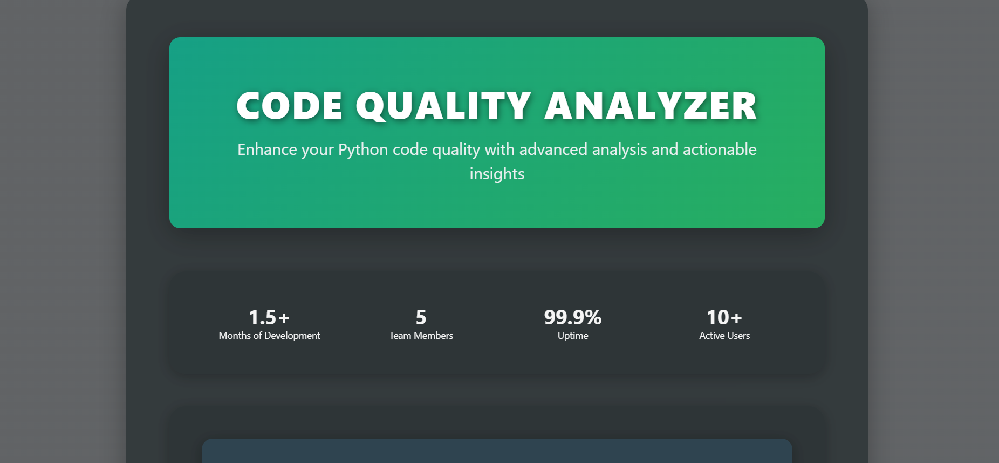
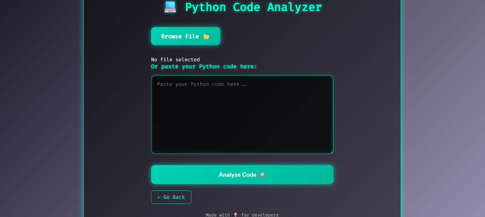
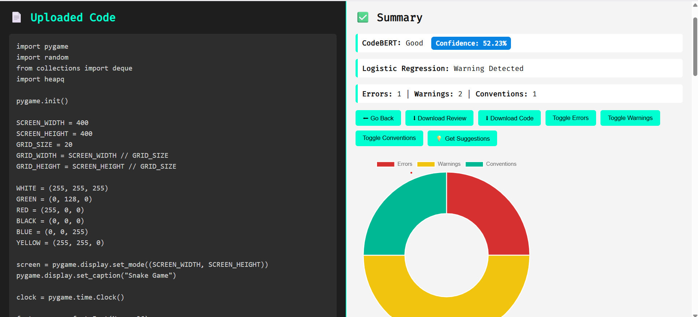
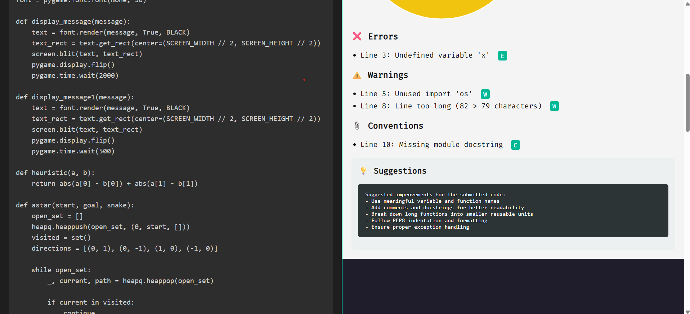

# CODE-REVIEW
PYTHON CODE REVIEW 
# 🧠 CodeSage – AI-Powered Python Code Quality Analyzer

**CodeSage** is a modern, full-stack web application that evaluates the quality of Python code using a combination of AI (fine-tuned CodeBERT), static analysis tools (Pylint), and a Logistic Regression model trained on linter outputs. It provides instant feedback on code quality, highlights errors/warnings, and suggests improvements.

🔍 [Live Demo / Screenshots Below](#-screenshots)

---

## ✨ Features

- 🧠 **CodeBERT Classification**: Uses a fine-tuned `codebert-base` model to classify code as "Good" or "Needs Improvement"
- ⚙️ **Logistic Regression Analysis**: Predicts code issues using linter feature counts (errors, warnings, conventions)
- 🗌 **Pylint Static Analysis**: Extracts and displays detailed error/warning messages with line highlights
- 💬 **Smart Suggestions**: Provides actionable suggestions powered by ChatGPT
- 📀 **Downloadable Review**: Export your full code review as a `.txt` file
- 💻 **Syntax Highlighting**: Code is beautifully displayed using Prism.js
- 📊 **Doughnut Chart**: Visual summary of issues using Chart.js
- 💾 **Responsive UI**: Works across desktop and mobile browsers

---

## 🚀 Getting Started

### Prerequisites

- Python 3.8+
- Pylint installed (`pip install pylint`)
- Flask (`pip install Flask`)
- Transformers (`pip install transformers`)
- Scikit-learn (`pip install scikit-learn`)
- Joblib (`pip install joblib`)
- Torch (`pip install torch`)

### Installation

```bash
git clone https://github.com/yourusername/CodeSage.git
cd CodeSage

# Create a virtual environment
python -m venv venv
source venv/bin/activate  # On Windows: venv\Scripts\activate

# Install Python dependencies
pip install -r requirements.txt
```

### Model Setup

- Place your **fine-tuned CodeBERT model** under: `./codebert_finetuned/`
- Save your **trained Logistic Regression model** as: `./models/logistic_model_python.joblib`

---

## 🧪 Running the Application

```bash
python app.py
```

Then open [http://localhost:5000](http://localhost:5000) in your browser.

---

## 📚 Project Structure

```
├── app.py                   # Main Flask backend
├── models/                  # Contains trained logistic_model_python.joblib
├── codebert_finetuned/     # Fine-tuned CodeBERT model files
├── templates/
│   ├── info.html            # Landing page
│   ├── index.html           # Upload/code input page
│   └── result.html          # Result and analysis display
├── static/
│   ├── styles.css           # Custom styling
│   ├── script.js            # Frontend JS (Chart, toggles, etc.)
├── screenshots/             # Screenshots for README
├── requirements.txt         # Python dependencies
└── README.md                # This file
```

---

## 🔒 Privacy & Security

- Uploaded code is processed **in-memory** and not stored.
- All temporary linter files are immediately deleted after analysis.
- Session data is short-lived and stored only for the current interaction.

---

## 📸 Screenshots

### 1. Initial Interface


### 2. Browse Page


### 3. Uploading Code


### 4. Output Results -1


### 4. Output Results -2



---

## 🛠️ Technologies Used

**Backend:**

- Flask (Python)
- Transformers (CodeBERT model)
- Pylint (Static Analysis)
- Scikit-learn (Logistic Regression)
- Joblib, NumPy

**Frontend:**

- HTML5, CSS3, JavaScript
- Prism.js (Syntax Highlighting)
- Chart.js (Doughnut Chart)
- Bootstrap (Optional for responsiveness)

---

## 🙏 Acknowledgements

- 🤖 [Microsoft CodeBERT](https://huggingface.co/microsoft/codebert-base)
- 🧪 [Pylint](https://pylint.pycqa.org/)
- 📊 [Chart.js](https://www.chartjs.org/)
- 🎨 [Prism.js](https://prismjs.com/)

---

## 🚧 Future Improvements

- Add multi-language code analysis (JavaScript, Java, C++)
- Integrate ESLint, Checkstyle, and Cppcheck
- Train ensemble models for improved predictions
- Allow PDF export of reports
- Add user accounts and history tracking

---

## 📝 License

This project is licensed under the [MIT License](LICENSE).

